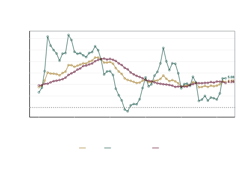
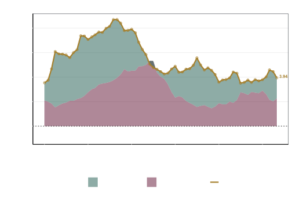
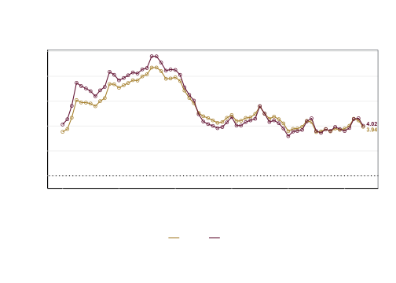
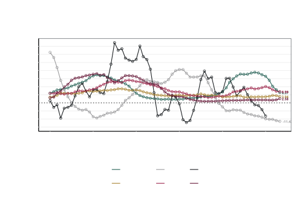
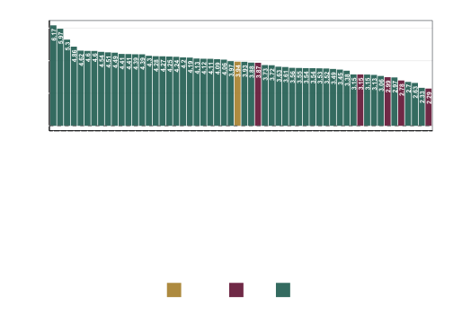
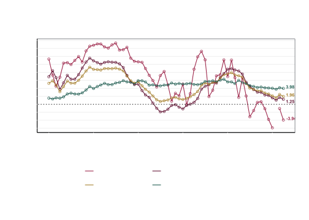
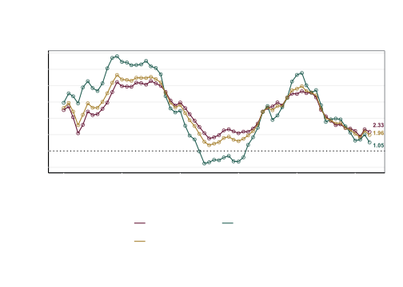

# README

## Inflación general, subyacente y no subyacente

Este repositorio contiene los códigos para automatizar la descarga de
las series de tiempo del índice Nacional de Precios al Consumidor, y sus
desagregaciones, para hacer el reporte sobre el comportamiento de los
precios.

El índice de precios al consumidor en May de 2026 registro un valor de
145.527, por su parte los índices subyacente y no subyacente tuvieron un
valor de 145.315299 y 145.8075421, respectivamente.

La inflación anual para el INPC general, subyacente y no subyacente fue
de 3.94%, 4.19% y 3.1%, respectivamente. Por su parte, las variaciones
mensuales fueron de -0.21%, 0.22% y -1.65%, respectivamente.

| Variable      | Fecha      |    Valor | Variación anual (%) | Variación mensual (%) |
|:--------------|:-----------|---------:|--------------------:|----------------------:|
| INPC          | 2026-05-01 | 145.5270 |            3.938948 |            -0.2084605 |
| No subyacente | 2026-05-01 | 145.8075 |            3.103299 |            -1.6548869 |
| Subyacente    | 2026-05-01 | 145.3153 |            4.186559 |             0.2234409 |

INPC, subyacente y no subyacente al mes de interés

Dentro de la inflación subyacente, el componente de Servicios tuvo una
variación anual de 4.57% y el de Mercancías de 3.78%. Por su parte,
dentro del componente no subyacente, los productos agropecuarios
tuvieron una variación anual de 2.9% y los energéticos y tarifas
autorizadas de 3.27%.

| Variable | Fecha | Valor | Variación anual (%) | Variación mensual (%) |
|:---|:---|---:|---:|---:|
| No subyacente - Agropecuarios | 2026-05-01 | 169.0648 | 2.903099 | -1.6426366 |
| No subyacente - Energéticos y tarifas autorizadas | 2026-05-01 | 128.9483 | 3.269862 | -1.6650404 |
| Subyacente - Mercancias | 2026-05-01 | 151.5845 | 3.784988 | 0.1576804 |
| Subyacente - Servicios | 2026-05-01 | 138.3863 | 4.570188 | 0.2858716 |

Componentes del INPC al mes de interés

------------------------------------------------------------------------

## Canasta de consumo mínimo

La inflación de los productos de la canasta básica fue de 4.02% anual y
-0.29% mensual. La diferencia en puntos porcentuales entre la inflación
general y la de la canasta de consumo mínimo fue de -0.08 puntos
porcentuales anual y 0.08 puntos porcentuales mensual.

## Productos básicos

En esta sección se analiza el comportamiento de cinco productos básico:
Tortilla, Frijol, Huevo, Leche y Carne de res. En May de 2026, la
variación anual de estos productos fue de 2.58% para la tortilla,
-11.43% para el frijol, -21.43% para el huevo, 6.96% para la leche y
6.37% para la carne de res. Por su parte, las variaciones mensuales
fueron de 0.81% para la tortilla, -0.82% para el frijol, -4.92% para el
huevo, 0.49% para la leche y 0.13% para la carne de res.

| Variable  |   Fecha    |   Valor | Variación anual (%) | Variación mensual (%) |
|:----------|:----------:|--------:|--------------------:|----------------------:|
| Carne res | 2026-05-01 | 171.551 |            6.373044 |             0.1307441 |
| Frijol    | 2026-05-01 | 145.581 |          -11.429301 |            -0.8195716 |
| Huevo     | 2026-05-01 | 150.149 |          -21.427450 |            -4.9184377 |
| INPC      | 2026-05-01 | 145.527 |            3.938948 |            -0.2084605 |
| Leche     | 2026-05-01 | 172.528 |            6.964258 |             0.4945276 |
| Tortilla  | 2026-05-01 | 162.129 |            2.580180 |             0.8145804 |

INPC, tortilla, frijol, huevo, leche y carne de res al mes de interés

## Inflación por Ciudad

La inflación promedio en las ciudades de la Zona Libre de la Frontera
Norte (ZLFN) fue de 3.02.

| Ciudad | Fecha | Valor | Variación anual (%) | Variación mensual (%) |
|:---|:---|---:|---:|---:|
| Chetumal, Q.R. | 2026-05-01 | 146.886 | 6.169859 | 0.2005566 |
| Tepatitlán, Jal. | 2026-05-01 | 154.382 | 5.966092 | 0.4299998 |
| Cancún, Q. Roo. | 2026-05-01 | 146.417 | 5.295822 | -0.1186976 |
| Guadalajara, Jal. | 2026-05-01 | 148.694 | 4.862517 | 0.3049068 |
| Campeche, Camp. | 2026-05-01 | 150.688 | 4.618290 | 0.1535322 |
| Mérida, Yuc. | 2026-05-01 | 152.322 | 4.600235 | 0.3544511 |
| Jacona, Mich. | 2026-05-01 | 153.614 | 4.597513 | 0.2623815 |
| Tepic, Nay. | 2026-05-01 | 147.468 | 4.543489 | 0.1895522 |
| Tuxtla Gutiérrez, Chis. | 2026-05-01 | 146.745 | 4.511043 | -0.0245263 |
| Atlacomulco, Méx. | 2026-05-01 | 146.751 | 4.491502 | -0.4409739 |
| San Andrés Tuxtla, Ver. | 2026-05-01 | 150.484 | 4.414316 | 0.6097398 |
| Colima, Col. | 2026-05-01 | 147.595 | 4.406293 | -0.1717969 |
| San Luis Potosí, S.L.P. | 2026-05-01 | 148.866 | 4.394109 | 0.0221725 |
| Cortazar, Gto. | 2026-05-01 | 144.466 | 4.391999 | 0.3961194 |
| Querétaro, Qro. | 2026-05-01 | 145.452 | 4.304052 | 0.0055004 |
| Torreón, Coah. | 2026-05-01 | 149.570 | 4.275745 | 0.1365773 |
| Durango, Dgo. | 2026-05-01 | 148.920 | 4.268920 | 0.0772823 |
| Córdoba, Ver. | 2026-05-01 | 151.376 | 4.254162 | 0.0363466 |
| León, Gto. | 2026-05-01 | 143.020 | 4.238184 | 0.0454689 |
| Iguala, Gro. | 2026-05-01 | 145.777 | 4.203837 | 0.1642183 |
| Chihuahua, Chih. | 2026-05-01 | 144.167 | 4.190998 | -0.0402149 |
| Tulancingo, Hgo. | 2026-05-01 | 144.186 | 4.133986 | 0.3696356 |
| Zacatecas, Zac. | 2026-05-01 | 145.616 | 4.119266 | 0.3030804 |
| Oaxaca, Oax. | 2026-05-01 | 151.824 | 4.114549 | -0.4432787 |
| Coatzacoalcos, Ver. | 2026-05-01 | 144.436 | 4.094267 | 0.3710859 |
| Área Met. de la CDMX | 2026-05-01 | 142.669 | 4.064276 | -0.0448390 |
| Veracruz, Ver. | 2026-05-01 | 144.751 | 3.972102 | 0.1584534 |
| Nacional | 2026-05-01 | 145.527 | 3.938948 | -0.2084605 |
| Pachuca, Hgo. | 2026-05-01 | 147.289 | 3.931046 | 0.5859415 |
| Morelia, Mich. | 2026-05-01 | 146.627 | 3.882477 | 0.3304959 |
| Matamoros, Tamps. | 2026-05-01 | 150.081 | 3.871629 | -1.1011387 |
| Esperanza, Son. | 2026-05-01 | 139.898 | 3.731111 | -3.3833574 |
| Hermosillo, Son. | 2026-05-01 | 139.933 | 3.720148 | -2.6959182 |
| Puebla, Pue. | 2026-05-01 | 147.361 | 3.631581 | -0.1280922 |
| Acapulco, Gro. | 2026-05-01 | 148.898 | 3.610048 | -0.0188013 |
| Saltillo, Coah. | 2026-05-01 | 144.166 | 3.560833 | 0.0819171 |
| Tapachula, Chis. | 2026-05-01 | 151.775 | 3.551911 | -0.1131974 |
| Tehuantepec, Oax. | 2026-05-01 | 154.050 | 3.542839 | -0.2118191 |
| Monclova, Coah. | 2026-05-01 | 140.433 | 3.538962 | 0.0662676 |
| Aguascalientes, Ags. | 2026-05-01 | 146.048 | 3.530212 | -0.3710980 |
| Cd. Jiménez, Chih. | 2026-05-01 | 144.265 | 3.519661 | -0.5075827 |
| Monterrey, N.L. | 2026-05-01 | 142.922 | 3.492422 | 0.0994537 |
| Izúcar de Matamoros, Pue. | 2026-05-01 | 143.954 | 3.453133 | -0.3537189 |
| Fresnillo, Zac. | 2026-05-01 | 149.998 | 3.384153 | 0.0153359 |
| Cuernavaca, Mor. | 2026-05-01 | 144.598 | 3.154606 | -0.3061182 |
| Mexicali, B.C. | 2026-05-01 | 141.478 | 3.151908 | -3.0434693 |
| Toluca, Edo. de Méx. | 2026-05-01 | 139.698 | 3.146874 | 0.1792783 |
| Huatabampo, Son. | 2026-05-01 | 143.827 | 3.126927 | -2.9631829 |
| Tampico, Tamps. | 2026-05-01 | 139.882 | 3.062051 | -0.0228712 |
| Cd. Juárez, Chih. | 2026-05-01 | 143.205 | 2.985171 | -0.9325299 |
| Culiacán, Sin. | 2026-05-01 | 144.949 | 2.970867 | -3.2647940 |
| Cd. Acuña, Coah. | 2026-05-01 | 143.962 | 2.783747 | 0.2409202 |
| Villahermosa, Tab. | 2026-05-01 | 140.188 | 2.697317 | 0.1135479 |
| La Paz, B.C.S. | 2026-05-01 | 138.013 | 2.633262 | -1.6889389 |
| Tlaxcala, Tlax. | 2026-05-01 | 143.811 | 2.333276 | -0.2130199 |
| Tijuana, B.C. | 2026-05-01 | 147.925 | 2.286007 | 0.0987962 |

Inflación por ciudad al mes de interés

## índice Nacional de Precios al Productor

El INPP registró una variación anual de 2.05% y una variación mensual de
0.28% en May de 2026.

Por grupos de actividad económica, el INPP primarias, el INPP
secundarias sin petróleo y el INPP terciarias tuvieron una variación
anual de -9.33%, 1.75%, y 4.55%, respectivamente. Las variaciones
mensuales para el INPP primarias, el INPP secundarias sin petróleo y el
INPP terciarias fueron de 1.8%, 0.21% y 0.24%, respectivamente.

El INPP de bienes finales tuvo una variación anual de 2.61% y una
variación mensual de 0.13%. Por su parte, el INPP intermedios tuvo una
variación anual de 0.64% y una variación mensual de 0.65%.

