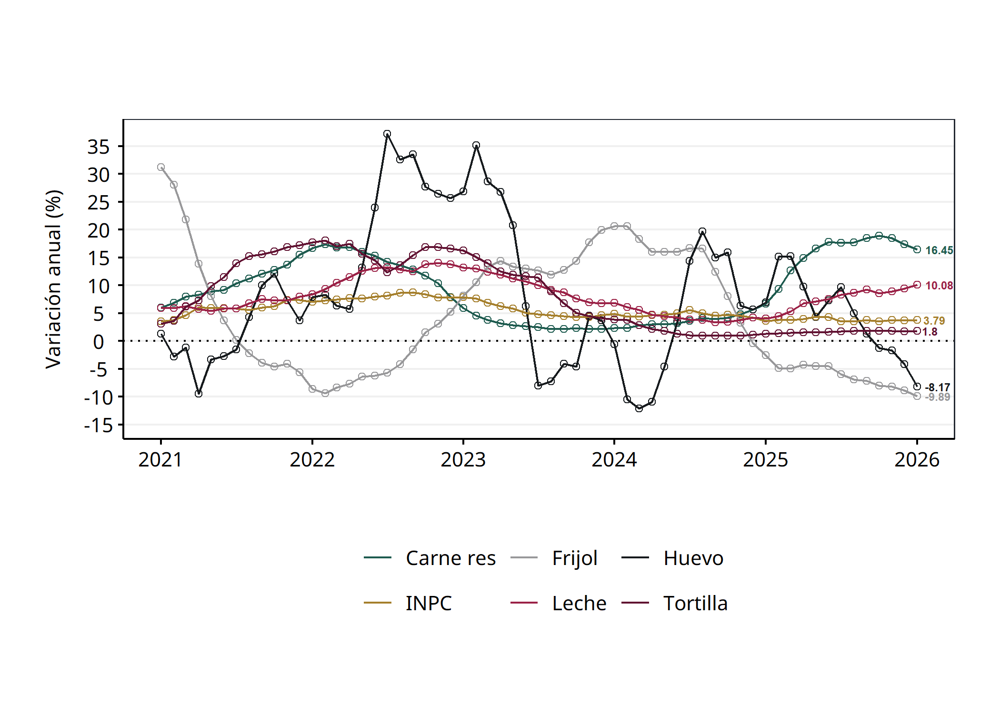
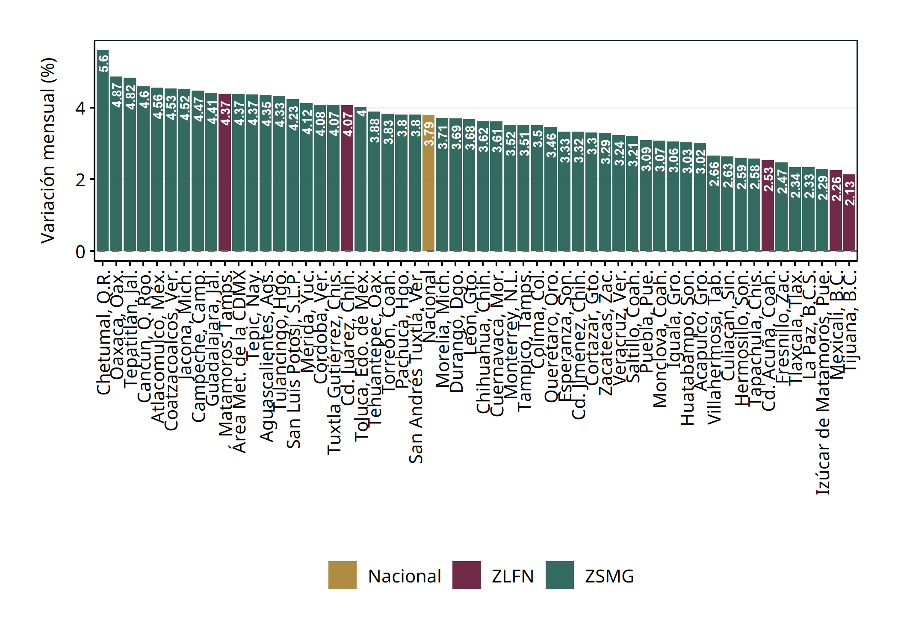
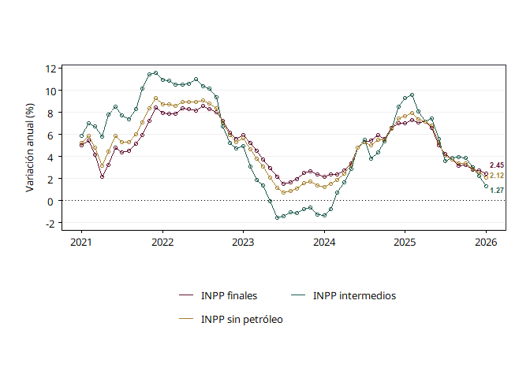

# README

## Inflación general, subyacente y no subyacente

El índice de precios al consumidor en January de 2026 registro un valor
de 143.588, por su parte los índices subyacente y no subyacente tuvieron
un valor de 143.3313259 y 144.0298102, respectivamente.

La inflación anual para el INPC general, subyacente y no subyacente fue
de 3.79%, 4.52% y 1.39%, respectivamente. Por su parte, las variaciones
mensuales fueron de 0.38%, 0.6% y -0.36%, respectivamente.

| Variable      | Fecha      |    Valor | Variación anual (%) | Variación mensual (%) |
|:--------------|:-----------|---------:|--------------------:|----------------------:|
| INPC          | 2026-01-01 | 143.5880 |            3.791301 |             0.3817061 |
| No subyacente | 2026-01-01 | 144.0298 |            1.386747 |            -0.3587415 |
| Subyacente    | 2026-01-01 | 143.3313 |            4.519170 |             0.6014009 |

INPC, subyacente y no subyacente al mes de interés

Dentro de la inflación subyacente, el componente de Servicios tuvo una
variación anual de 4.48% y el de Mercancías de 4.56%. Por su parte,
dentro del componente no subyacente, los productos agropecuarios
tuvieron una variación anual de 1.52% y los energéticos y tarifas
autorizadas de 1.28%.

| Variable | Fecha | Valor | Variación anual (%) | Variación mensual (%) |
|:---|:---|---:|---:|---:|
| No subyacente - Agropecuarios | 2026-01-01 | 160.7256 | 1.519723 | -0.8628424 |
| No subyacente - Energéticos y tarifas autorizadas | 2026-01-01 | 131.3457 | 1.284095 | 0.0348357 |
| Subyacente - Mercancias | 2026-01-01 | 149.8595 | 4.562851 | 0.9239147 |
| Subyacente - Servicios | 2026-01-01 | 136.1988 | 4.477602 | 0.2961445 |

Componentes del INPC al mes de interés

------------------------------------------------------------------------

## Canasta de consumo mínimo

La inflación de los productos de la canasta básica fue de 3.6% anual y
0.38% mensual. La diferencia en puntos porcentuales entre la inflación
general y la de la canasta de consumo mínimo fue de 0.19 puntos
porcentuales anual y 0 puntos porcentuales mensual.

## Productos básicos

En esta sección se analiza el comportamiento de cinco productos básico:
Tortilla, Frijol, Huevo, Leche y Carne de res. En January de 2026, la
variación anual de estos productos fue de 1.8% para la tortilla, -9.89%
para el frijol, -8.17% para el huevo, 10.08% para la leche y 16.45% para
la carne de res. Por su parte, las variaciones mensuales fueron de 0.29%
para la tortilla, -1.49% para el frijol, -6.31% para el huevo, 0.87%
para la leche y 0.53% para la carne de res.

| Variable  | Fecha      |   Valor | Variación anual (%) | Variación mensual (%) |
|:----------|:-----------|--------:|--------------------:|----------------------:|
| Carne res | 2026-01-01 | 170.808 |           16.452589 |             0.5279234 |
| Frijol    | 2026-01-01 | 153.287 |           -9.888424 |            -1.4928347 |
| Huevo     | 2026-01-01 | 172.658 |           -8.166989 |            -6.3097577 |
| INPC      | 2026-01-01 | 143.588 |            3.791301 |             0.3817061 |
| Leche     | 2026-01-01 | 170.803 |           10.079013 |             0.8675163 |
| Tortilla  | 2026-01-01 | 159.427 |            1.801986 |             0.2944155 |

INPC, tortilla, frijol, huevo, leche y carne de res al mes de interés

## Inflación por Ciudad

La inflación promedio en las ciudades de la Zona Libre de la Frontera
Norte (ZLFN) fue de 3.07.

| Ciudad | Fecha | Valor | Variación anual (%) | Variación mensual (%) |
|:---|:---|---:|---:|---:|
| Chetumal, Q.R. | 2026-01-01 | 144.694 | 5.598330 | 1.3036294 |
| Oaxaca, Oax. | 2026-01-01 | 150.271 | 4.869011 | 0.3680203 |
| Tepatitlán, Jal. | 2026-01-01 | 150.374 | 4.815078 | 0.5671254 |
| Cancún, Q. Roo. | 2026-01-01 | 144.997 | 4.595819 | 1.0720833 |
| Atlacomulco, Méx. | 2026-01-01 | 143.944 | 4.556515 | 0.6932348 |
| Coatzacoalcos, Ver. | 2026-01-01 | 143.325 | 4.529045 | 0.8365228 |
| Jacona, Mich. | 2026-01-01 | 149.818 | 4.519325 | 0.3402317 |
| Campeche, Camp. | 2026-01-01 | 149.143 | 4.474799 | 0.9810825 |
| Guadalajara, Jal. | 2026-01-01 | 145.147 | 4.414039 | 0.7881288 |
| Matamoros, Tamps. | 2026-01-01 | 149.953 | 4.371037 | 0.6348695 |
| Área Met. de la CDMX | 2026-01-01 | 140.349 | 4.370427 | 0.2628928 |
| Tepic, Nay. | 2026-01-01 | 144.865 | 4.369597 | 0.8465078 |
| Aguascalientes, Ags. | 2026-01-01 | 144.384 | 4.350089 | 0.4417422 |
| Tulancingo, Hgo. | 2026-01-01 | 142.035 | 4.325503 | -0.0408183 |
| San Luis Potosí, S.L.P. | 2026-01-01 | 145.962 | 4.233258 | 0.4542264 |
| Mérida, Yuc. | 2026-01-01 | 151.287 | 4.122590 | 1.1682493 |
| Córdoba, Ver. | 2026-01-01 | 148.516 | 4.077142 | 0.3167913 |
| Tuxtla Gutiérrez, Chis. | 2026-01-01 | 143.824 | 4.073983 | 0.7184975 |
| Cd. Juárez, Chih. | 2026-01-01 | 143.105 | 4.065768 | 0.5120245 |
| Toluca, Edo. de Méx. | 2026-01-01 | 137.627 | 4.002086 | 0.0465241 |
| Tehuantepec, Oax. | 2026-01-01 | 152.453 | 3.882662 | 0.5692988 |
| Torreón, Coah. | 2026-01-01 | 148.234 | 3.833680 | 0.7325559 |
| Pachuca, Hgo. | 2026-01-01 | 143.737 | 3.803712 | 0.5772783 |
| San Andrés Tuxtla, Ver. | 2026-01-01 | 147.188 | 3.802646 | 0.8461628 |
| Nacional | 2026-01-01 | 143.588 | 3.791301 | 0.3817061 |
| Morelia, Mich. | 2026-01-01 | 143.658 | 3.706217 | 0.3520684 |
| Durango, Dgo. | 2026-01-01 | 145.901 | 3.691359 | -0.0985997 |
| León, Gto. | 2026-01-01 | 140.361 | 3.676210 | 0.2678839 |
| Chihuahua, Chih. | 2026-01-01 | 141.808 | 3.623702 | 0.3183407 |
| Cuernavaca, Mor. | 2026-01-01 | 142.619 | 3.607622 | 0.4366228 |
| Monterrey, N.L. | 2026-01-01 | 142.109 | 3.518382 | 0.1430524 |
| Tampico, Tamps. | 2026-01-01 | 139.328 | 3.513399 | 0.1307979 |
| Colima, Col. | 2026-01-01 | 144.842 | 3.503669 | 0.3067888 |
| Querétaro, Qro. | 2026-01-01 | 142.313 | 3.462741 | 0.1428471 |
| Esperanza, Son. | 2026-01-01 | 142.655 | 3.326766 | 0.1847014 |
| Cd. Jiménez, Chih. | 2026-01-01 | 142.645 | 3.323265 | 0.2480814 |
| Cortazar, Gto. | 2026-01-01 | 141.452 | 3.303172 | 0.1408820 |
| Zacatecas, Zac. | 2026-01-01 | 142.545 | 3.285994 | 0.6844380 |
| Veracruz, Ver. | 2026-01-01 | 142.172 | 3.235644 | 0.5509467 |
| Saltillo, Coah. | 2026-01-01 | 142.068 | 3.211839 | 0.6325483 |
| Puebla, Pue. | 2026-01-01 | 144.357 | 3.085635 | 0.3964197 |
| Monclova, Coah. | 2026-01-01 | 139.604 | 3.073663 | 0.5937455 |
| Iguala, Gro. | 2026-01-01 | 142.860 | 3.055004 | 0.4055298 |
| Huatabampo, Son. | 2026-01-01 | 146.298 | 3.028212 | 0.0109378 |
| Acapulco, Gro. | 2026-01-01 | 145.747 | 3.018158 | -0.0514326 |
| Villahermosa, Tab. | 2026-01-01 | 140.413 | 2.663596 | 0.6126485 |
| Culiacán, Sin. | 2026-01-01 | 146.980 | 2.631064 | 0.2291263 |
| Hermosillo, Son. | 2026-01-01 | 141.512 | 2.588044 | -0.0381448 |
| Tapachula, Chis. | 2026-01-01 | 149.888 | 2.580808 | 0.5541318 |
| Cd. Acuña, Coah. | 2026-01-01 | 144.923 | 2.530669 | 0.0994619 |
| Fresnillo, Zac. | 2026-01-01 | 146.871 | 2.471952 | -0.0108927 |
| Tlaxcala, Tlax. | 2026-01-01 | 141.310 | 2.343671 | -0.0014153 |
| La Paz, B.C.S. | 2026-01-01 | 138.723 | 2.334794 | -0.1130472 |
| Izúcar de Matamoros, Pue. | 2026-01-01 | 140.120 | 2.286332 | 0.2138448 |
| Mexicali, B.C. | 2026-01-01 | 143.700 | 2.256474 | 0.3814074 |
| Tijuana, B.C. | 2026-01-01 | 145.944 | 2.134449 | -0.1279674 |

Inflación por ciudad al mes de interés

## índice Nacional de Precios al Productor

El INPP registró una variación anual de 2.12% y una variación mensual de
0.14% en January de 2026.

Por grupos de actividad económica, el INPP primarias, el INPP
secundarias sin petróleo y el INPP terciarias tuvieron una variación
anual de -5.9%, 1.61%, y 4.02%, respectivamente. Las variaciones
mensuales para el INPP primarias, el INPP secundarias sin petróleo y el
INPP terciarias fueron de -2.41%, 0.74% y -0.64%, respectivamente.

El INPP de bienes finales tuvo una variación anual de 2.45% y una
variación mensual de 0.03%. Por su parte, el INPP intermedios tuvo una
variación anual de 1.27% y una variación mensual de 0.44%.

